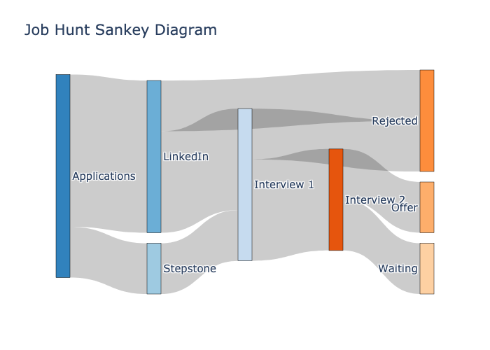

# 📊 Sankey Diagram for Job Application Flow

Here I create a visualization of the journey of job applications using a Sankey diagram. It shows how applications progress across platforms, interviews, and final statuses.

## 🚀 Features

- Prepare your .xlsx file
- Run `python notebooks/main.py --filepath [path to .xlsx file]`
- Visualize progress across multiple interviews and final outcomes

## 📁 Input Format

The Excel file must contain at least the following columns:

| Column Name      | Description                                   |
| ---------------- | --------------------------------------------- |
| `Platform`       | Source of the application (e.g., LinkedIn)    |
| `Nb. Interviews` | Number of interviews completed (integer)      |
| `Status`         | Final status (e.g., Offer, Rejected, Waiting) |

## 📊 The Result

